# 🌀 Impeller AI

🌐 **Language / 語言**: [English](./README.md) | [繁體中文](./README.zh-TW.md)

---

**Impeller AI** 是一個專為您的 Logseq 圖譜量身打造的高效能自主 AI 引擎。它與 **Logseq 右側邊欄**進行了深度的類型安全（type-safe）整合，為您提供一個自然、極速且強大的 AI 人機協作工作區。

作為一個**通用 LLM 入口**，它能將具備上下文感知的智慧內容直接注入您的節點大綱（Outlines）中，同時嚴格遵守您圖譜的原生結構。

### 📸 功能預覽

`0.5.0`
|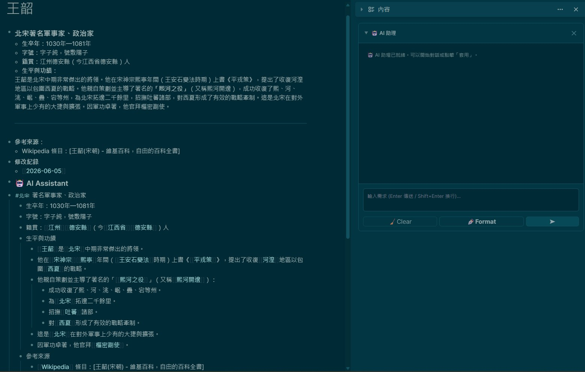|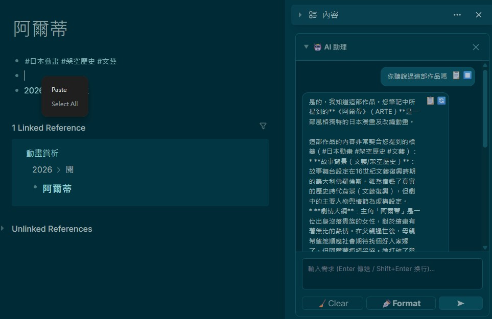|
|:---:|:---:|
| *智慧層級排版* | *便捷對話操作 (複製/重新生成)* |

`0.6.0`
||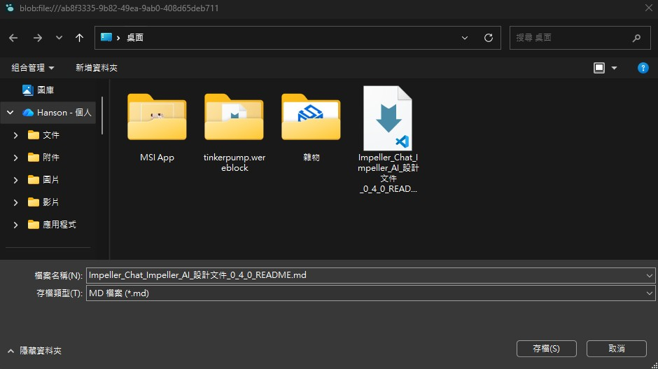|
|:---:|:---:|
|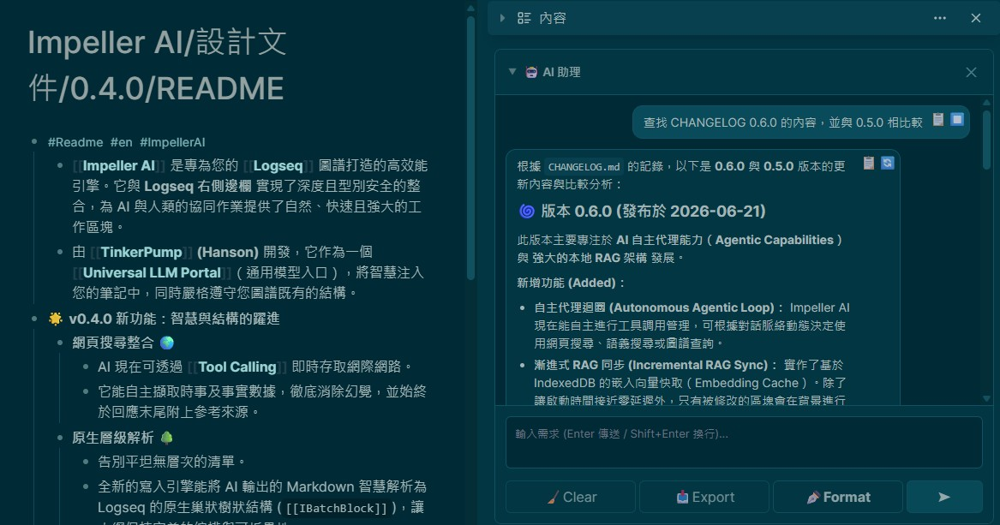|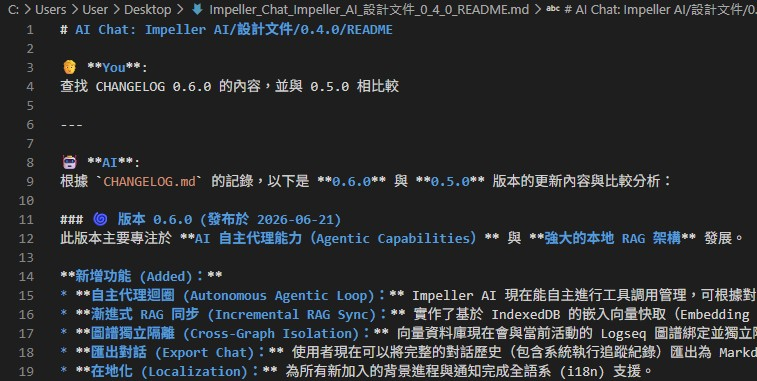|
| *增量 RAG 向量同步* | *一鍵匯出對話* |

`0.7.0`
|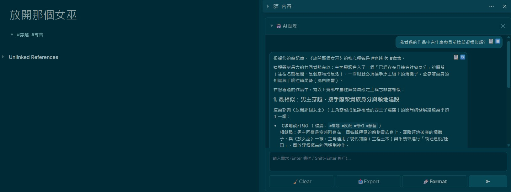|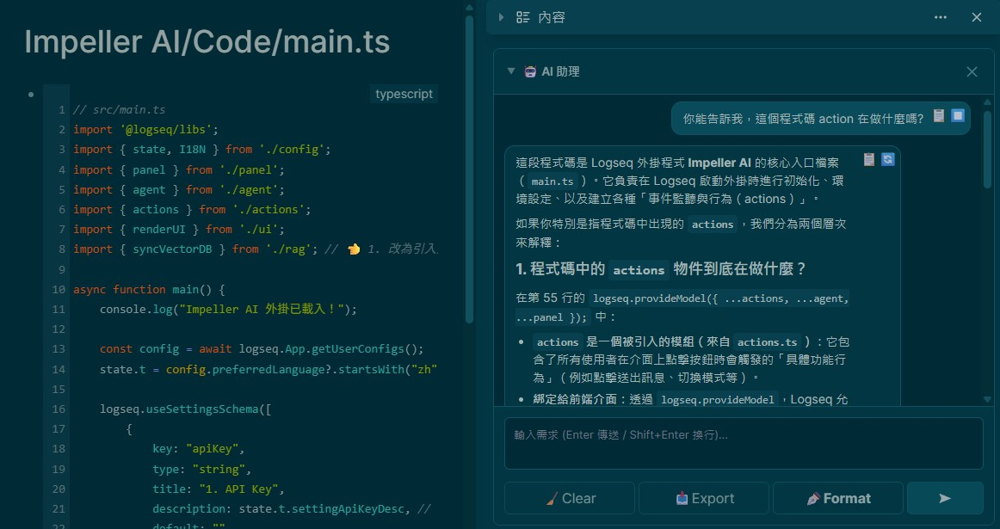|
|:---:|:---:|
| *自主網路搜尋與知識庫探索* | *圖譜導航 (精準鎖定單行節點)* |

`0.8.0`
|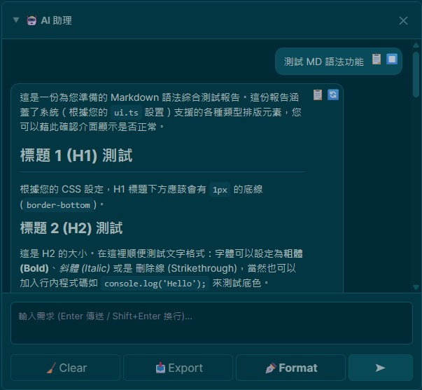|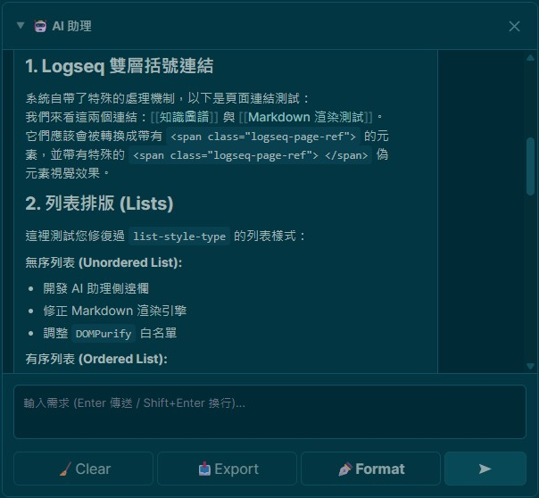|
|:---:|:---:|
| *豐富渲染：標題* | *豐富渲染：連結與列表* |
|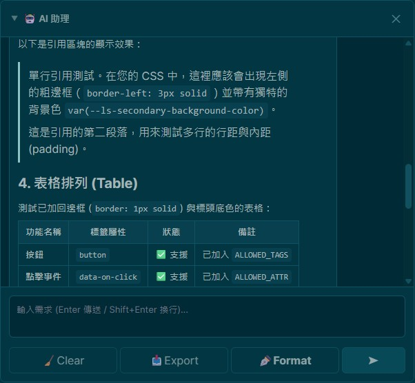|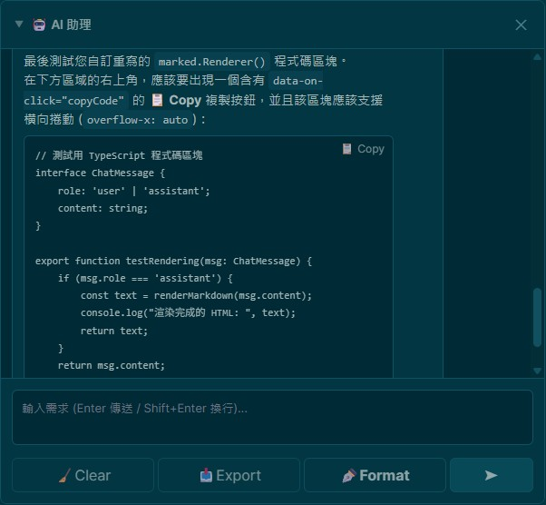|
| *豐富渲染：區塊引用與表格* | *豐富渲染：程式碼區塊 (可複製)* |

`0.9.0`
|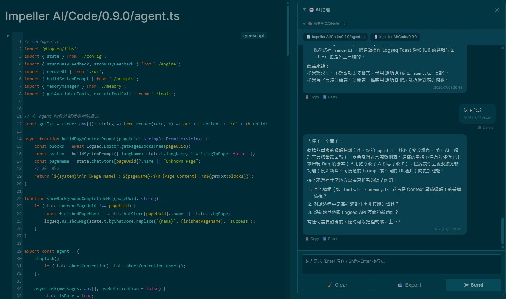|
|:---:|
| *持久化的分頁對話歷史紀錄* |

---

## 核心功能

Impeller AI 深度整合了 Logseq 的區塊（Block）生態系統。它不僅僅是一個聊天介面，而是直接在您的工作區內部運行的自主推論引擎：

### 🧠 自主代理引擎 (Autonomous Agentic Engine)
* **動態工具呼叫（最高 7 次迭代）**：由強大的推理迴圈驅動（`maxIterations: 7`）。AI 可自主決定何時觸發 `semantic_search`（本地向量庫檢索）、全域關鍵字查詢（Datalog）或 `web_search`（網路搜尋）。
* **嚴格防幻覺機制**：系統提示詞會強制 AI 在處理時事時使用 `web_search`，並強制附加「參考來源 (Sources)」區塊，嚴格區分客觀事實與 AI 推論。
* **增量 RAG 與 IndexedDB 快取**：基於 Orama 與 Transformers.js（`bge-small-zh-v1.5` 嵌入模型）建構。向量資料（Embeddings）會持久化快取於 IndexedDB（`ImpellerRAG_Cache`）中。啟動時會在背景執行極速的差異同步，僅針對近期修改過的區塊進行更新。

### 🌳 原生區塊與上下文處理
* **AST 轉巢狀區塊**：突破純文字限制。內部的 AST 解析器（`parseMarkdownToTree`）能將 AI 生成的 Markdown 直接轉換為 Logseq 原生的巢狀父子區塊。它還會自動在區塊前加上水平分隔線與自訂標籤（例如 `--- \n#AI`）以保持層級視覺的整潔。
* **自動雙向連結**：提示詞層級的約束會指示 AI 在生成內容時，自動識別圖譜中的核心概念，並將其包裹在 `Wiki-links (雙向連結)` 中。
* **進階記憶體管理與自動壓縮**：由升級版的 `MemoryManager` 驅動，採用滑動視窗（Sliding window）機制並結合無損壓縮技術。這大幅擴展了有效的上下文容量，消除了 Token 溢位的風險，無縫地保留您的長期對話脈絡。

### ✨ 精緻的側邊欄工作流
* **持久化歷史紀錄與時間戳（v0.9.0 全新功能！）**：導入永久性的對話歷史紀錄系統與分頁列表，讓您可以輕鬆導覽並恢復過去的會話。每一次互動都奠基於精確的時間戳記（`YYYY-MM-DD HH:mm`）。
* **側邊欄介面重構（v0.9.0 全新功能！）**：經過人體工學優化的側邊欄介面，能智慧地佔用完整寬度，達到最大化的閱讀體驗。
* **豐富的 Markdown 渲染**：開箱即支援完整的原生 Markdown 渲染。輸出內容能輕鬆呈現層次分明的**標題**、精確的**連結**、原生的**列表**、優雅的**引用區塊**、複雜的**表格**以及具備語法突顯的**程式碼區塊**。
* **智慧應用 (Apply) 邏輯**：「應用」指令會動態分析聊天上下文。它能智慧地在 `applyReformat`（純粹修復結構縮排而不新增文字）和 `applyContext`（附加新生成的區塊）兩種模式之間靈活切換。
* **零摩擦 Markdown 剪貼簿**：將游標懸停在聊天訊息上即可顯示精確的控制項（複製、重新生成、刪除）。複製功能會直接從 DOM 提取預處理過的純 Markdown，防止瀏覽器 HTML 污染。
* **非阻塞與可匯出**：支援透過 `AbortController` 手動取消生成任務。您可以輕鬆地透過命令面板（`export-ai-chat`）將整個聊天紀錄（包含深度的工具執行軌跡）匯出為乾淨的 Markdown 檔案。

---

### 📥 安裝說明 (未打包的外掛)

1. 下載此儲存庫（點擊 GitHub 上的 `Code` -> `Download ZIP`）並將資料夾解壓縮到您電腦上的安全位置。
2. 開啟 Logseq。點擊右上角的三點選單 `...` 並選擇 **設定 (Settings)**。
3. 前往 **進階 (Advanced)** 標籤頁並開啟 **開發者模式 (Developer mode)**。
4. 關閉設定，再次點擊三點選單 `...`，並選擇 **外掛 (Plugins)**。
5. 點擊 **載入未打包的外掛 (Load unpacked plugin)** 按鈕，然後選擇剛剛解壓縮的 `logseq-impeller-ai` 資料夾。
6. 外掛現在已成功啟用！

---

### 📦 使用指南

Impeller UI 常駐於您的 **右側邊欄** 中，作為您跨頁面持續存在的創意夥伴。

- **開關側邊欄**：點擊上方工具列中的 **AI Assistant** 圖示以顯示或隱藏面板。
- **對話互動**：在輸入框輸入您的指令。按下 `Enter` 送出，或使用 `Shift+Enter` 換行。透過全新的**分頁歷史紀錄**功能，可輕鬆導覽並接續先前的對話。
- **訊息節點操作**：將鼠標懸停在任何回應氣泡上，可顯示節點控制項：
  - **📋 複製 (Copy)**：即時截取回應內容（繞過 iframe 沙盒邊界限制）。
  - **⏹️ 刪除 (Delete)**：銷毀該提示節點並安全地切斷後續的上下文，以維持對話的連貫性。
  - **🔄 重新生成 (Regenerate)**：強制重新評估該節點步驟，並具備自動化的結構復原防護機制。
- **操作按鈕**：
  - **✒️ 格式化 (Format)**：執行具備上下文感知的頁面佈局重寫或插入 AI 見解。
  - **🧹 清除 (Clear)**：清空當前頁面的對話狀態以便重新開始。包含一個**防呆確認機制**，以防止意外刪除對話上下文。
  - **■ 停止 (Stop)**：終止掛起的遠端伺服器請求，同時優雅地保存工具日誌與部分已生成的內容軌跡。
  - **📥 匯出 (Export)**：立即將您的對話紀錄與系統工具執行軌跡匯出至結構化的本地 Markdown 檔案中。也可透過命令面板喚出。

---

### 🛠️ 配置設定

您可直接在官方的 Logseq 外掛設定面板中調整以下數值：

- **API Key**：您選擇的推論供應商所需的金鑰憑證。
- **Model**：您的目標 LLM 模型識別碼（例如 `openai/gpt-4o-mini`，兼容任何標準的 OpenAI 規範格式）。
- **Base Path**：自訂連線路由。非常適合用來連接 OpenRouter、API 網關，或是離線的本地終端（例如 Ollama / LM Studio）。
- **Web Search API Key**：*(選填)* 填入您的 Tavily API 字串，解鎖即時搜尋能力以及自動化的事實查核。
- **自訂標籤 (Custom Tag)**：定義插入結構更新時的標籤區塊（例如 `#AI`）。Impeller 原生支援在區塊正上方插入乾淨的 `---` 水平分隔線，讓排版視覺更加簡潔。
- **智慧索引效能 (Smart Indexing)**：初始設定會對您的全域圖譜節點進行一次完整同步分析；之後的每次工作流程，都將透過本地的差異快取層實現「秒級」載入。

---

### 📺 影片演示

  
*(註：本影片展示的是 **v0.2.0** 版本的核心介面與工作流。雖然基本互動方式保持不變，但如持久化歷史紀錄、網路搜尋、系統軌跡以及進階訊息控制等較新功能並未在影片中展現，其皆遵循相同的直覺化設計理念。)*

---

## 🐞 反饋與問題回報

發現了 Bug 或是有效能優化的好點子嗎？我們非常樂意聽取您的意見！請隨時在 GitHub 上 [發起 Issue](https://github.com/hhs456/logseq-impeller-ai/issues)。

---

## 📜 版本實作與發布

我們嚴格遵守 [語意化版本 (Semantic Versioning)](https://semver.org/) 規範。如需查看完整的更新日誌與細粒度的版本軌跡記錄，請參閱專屬的 [CHANGELOG.md](./CHANGELOG.md) 文件。

---

### 📄 授權條款

本專案採用 **MIT License** 開源授權。